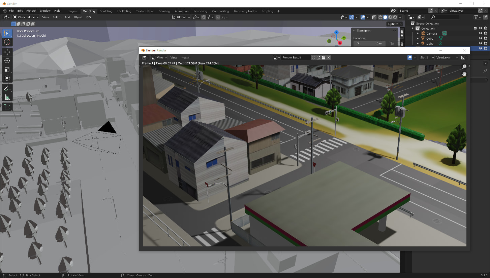
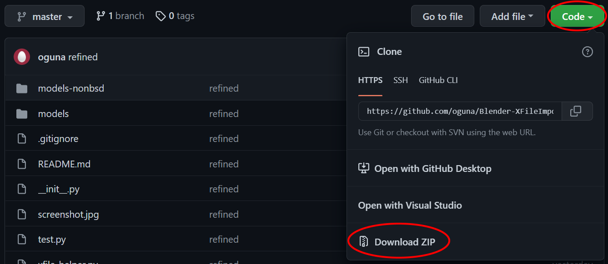
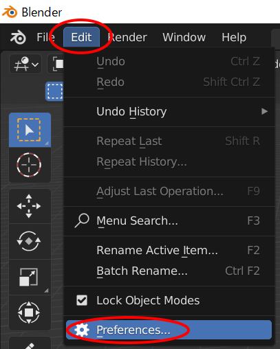
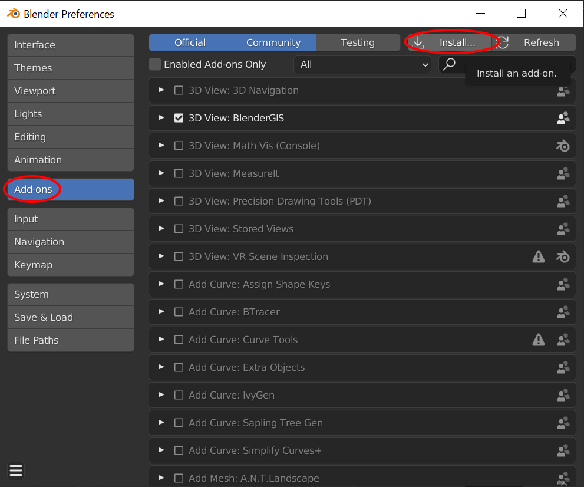
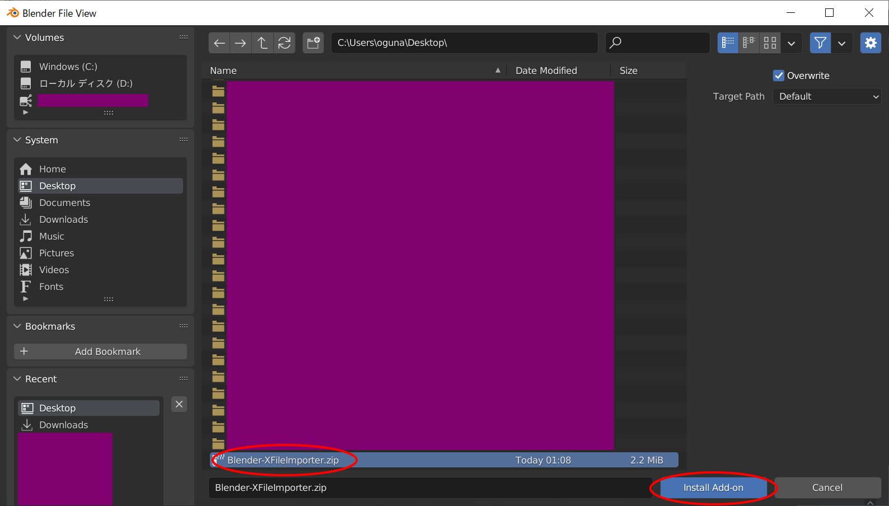
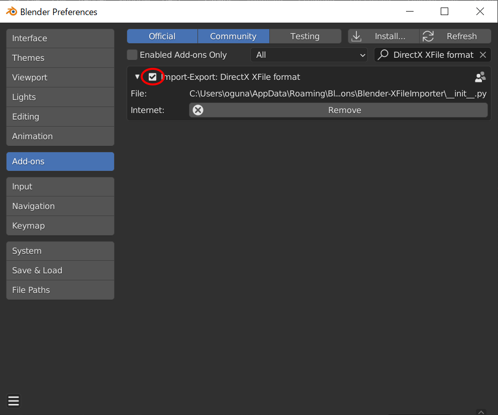

# Blender XFile Importer

This blender addon can import DirectX XFile (.x).



## Features

- [ ] Animation
- [x] Binary

## How to install

### 1. "Code" -> "Download ZIP"

### 2. "Edit" -> "Preferences..."

### 3. "Add-ons" -> "Install..."

### 4. Select downloaded zip file -> "Install Add-on"

### 5. Check "Import-Export: DirectX XFile Format"


## Hot to test

```shell
python test_parser.py
```

```shell
"C:\Program Files\Blender Foundation\Blender 4.5\blender.exe"  --background --python test_importer.py
```

## License

Our license is based on the modified, 3-clause BSD-License.

Some source code in this project were introduced from Assimp.
So our license was inherited from it.

```
AN EXCEPTION applies to all files in the ./models-nonbsd folder.
These are 3d models for testing purposes, from various free sources
on the internet. They are - unless otherwise stated - copyright of
their respective creators, which may impose additional requirements
on the use of their work. For any of these models, see
<model-name>.source.txt for more legal information. Contact us if you
are a copyright holder and believe that we credited you inproperly or
if you don't want your files to appear in the repository.
```